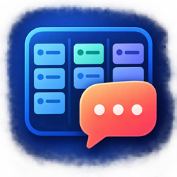

<p align="center">
  
</p>

# Boards Discuss

Stay in flow while keeping up with Azure Boards. Boards Discuss adds a focused Activity Bar panel for finding work items, reading their context, and participating in their discussion threads—without bouncing between your editor and a browser.

## What you can do

- Search by title, tag, or work-item ID (`#1234`).
- Filter by assignment, state, and work-item type.
- Sort by recent activity, ID, or title.
- Pin active work and favorite items you want to revisit.
- Read the description and acceptance criteria beside the discussion.
- Read rich discussion posts and safely open their links.
- Write formatted replies with bold, italic, code, and links.
- Type `@` plus two characters to find and mention a coworker.
- Delete comments that you authored, with a confirmation step.
- Receive configurable VS Code notifications for new @mentions.
- Open the selected item in Azure DevOps when you need the full work-item form.

Pinned items are shown first. Favorites stay close by even when they no longer match the current search.

## Get started

1. Install Boards Discuss and select its speech-bubble icon in the Activity Bar.
2. Choose **Configure organization**.
3. Enter your Azure DevOps organization and, optionally, a project.
4. Create a personal access token in Azure DevOps with **Work Items — Read & write** scope.
5. Choose **Save PAT** and paste the token.

The PAT is stored with VS Code's encrypted SecretStorage API. It is never saved in `settings.json`, extension logs, or workspace files.

You can also run any command from the Command Palette (`Ctrl+Shift+P` / `Cmd+Shift+P`):

- `Boards Discuss: Open`
- `Boards Discuss: Configure Azure DevOps Connection`
- `Boards Discuss: Save Personal Access Token`
- `Boards Discuss: Forget Personal Access Token`
- `Boards Discuss: Refresh`
- `Boards Discuss: Show Help`

## Using the panel

### Find the right work

Search is debounced as you type. Enter plain text to match work-item titles and tags, or enter a numeric ID—with or without `#`—to go directly to an item. Comma-separated State and Type fields let you combine filters such as `Active, New` and `Bug, User Story`.

Clear **Assigned to me** when you need to explore team work. The result limit is controlled by `boardsDiscuss.pageSize`.

### Read and reply

Select an item, then switch among **Discussion**, **Description**, and **Acceptance criteria**. Rich content is sanitized before it reaches the panel. Web and email links open through VS Code's trusted external-link flow.

The composer supports a small, predictable Markdown subset:

| Input | Result |
| --- | --- |
| `**important**` | Bold |
| `_emphasis_` | Italic |
| `` `code` `` | Inline code |
| `[label](https://example.com)` | Link |

Press `Ctrl+Enter` or `Cmd+Enter` to post. Type `@` followed by at least two characters to search Azure DevOps identities; choosing a result inserts a real Azure DevOps mention that can notify that person.

### Mentions

Boards Discuss periodically checks recently updated items for comments that mention your Azure DevOps identity. Select **Open discussion** on a notification to jump directly to the item. Checks run only while VS Code and the extension are active.

Set `boardsDiscuss.notificationIntervalMinutes` to `0` to turn mention notifications off.

## Settings

| Setting | Default | Purpose |
| --- | --- | --- |
| `boardsDiscuss.organization` | empty | Organization name or canonical `dev.azure.com` URL. |
| `boardsDiscuss.project` | empty | Optional project name; empty searches accessible projects. |
| `boardsDiscuss.pageSize` | `50` | Result count, from 10 to 200. |
| `boardsDiscuss.notificationIntervalMinutes` | `5` | @mention polling interval; `0` disables it. |

Connection settings are global because they describe your account rather than a particular source folder. Favorite, pin, filter, and last-selection state is also retained globally.

## Token permissions and privacy

Use the narrowest PAT possible:

- Scope: **Work Items — Read & write**
- Organization: only the organization you configured
- Expiration: a short period that fits your team's rotation policy

Boards Discuss communicates directly with Azure DevOps over HTTPS. It has no analytics service and does not transmit work-item data anywhere else. Forgetting the PAT removes it from VS Code SecretStorage immediately.

## Troubleshooting

**401 or 403 from Azure DevOps**  
Replace the saved PAT and confirm it is active, belongs to the configured organization, and has Work Items read/write permission.

**No work items appear**  
Clear **Assigned to me**, remove State/Type filters, confirm the exact project name, and refresh. An empty project setting searches across projects visible to your account.

**Coworkers do not appear after `@`**  
Enter at least two characters and confirm the PAT can read identities in the organization. Some organizations restrict identity search through their access policy.

**Mention notifications are late**  
Checks occur at the configured interval and only while VS Code is running. Set a shorter interval if your organization permits the added API traffic.

For sensitive reports, see [SECURITY.md](SECURITY.md). For product questions and reproducible bugs, open an issue in the repository listed by the extension manifest.

## Development

```text
npm install
npm run check
npm run package
```

Press `F5` in VS Code to launch an Extension Development Host. The complete check runs TypeScript validation, ESLint, a production build, and the Node test suite.

## License

[MIT](LICENSE) © barberod
